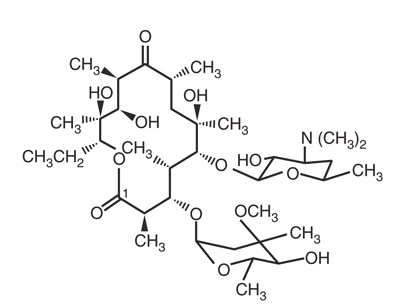
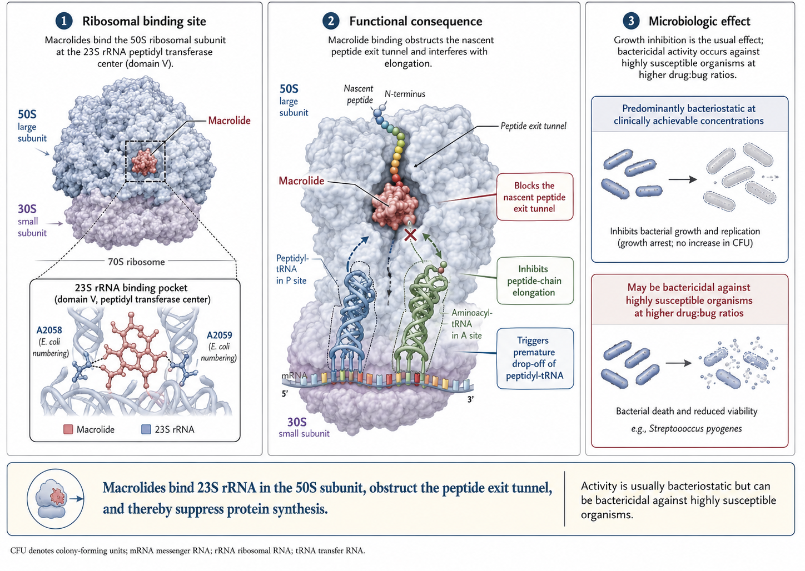
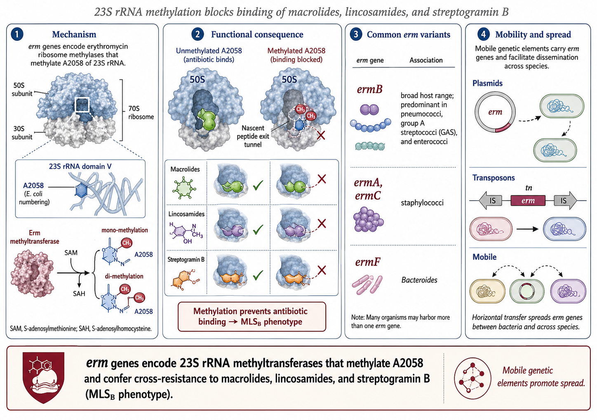
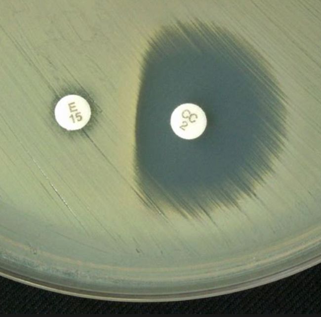
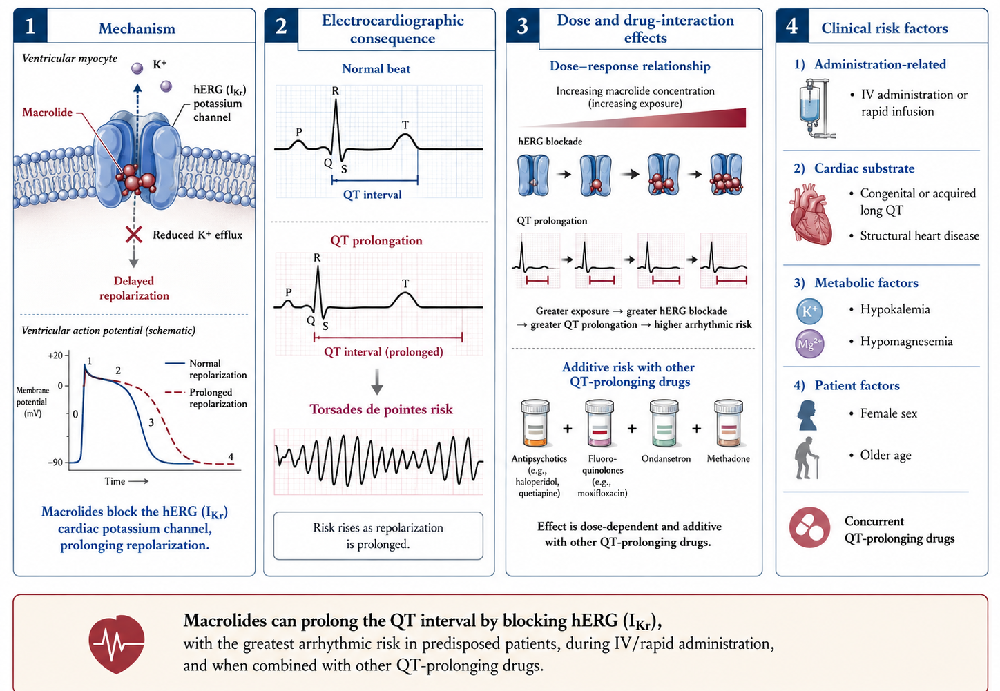

## Macrolides, Ketolides   and Clindamycin {.light-text background-color="#b20e10" background-video="macrolides-images/molecules.mp4" background-video-loop="true" background-video-muted="true" background-opacity="0.4"}

**Russell E. Lewis, Pharm.D**   Associate Professor of Infectious Diseases (MEDS-10/B)  

   

{fig-align="center" width="350"}

   russelledward.lewis\@unipd.it    [https://github.com/Russlewisbo](https://github.com/Russlewisbo/ESCMID_2022_talk)   Slides and course materials: [www.idpadova.com](https://padovaid.com/)

 

## Outline

 

- Chemistry, mechanism of action, and the 50S ribosome
- The three resistance mechanisms (and why MLS~B~ matters)
- Pharmacology of erythromycin, clarithromycin, azithromycin
- Cardiac safety — what Ray *et al.* taught us
- Antimicrobial spectrum and key clinical uses
- Ketolides — telithromycin and the solithromycin story
- Clindamycin — anaerobes, MRSA, and toxin suppression
- Practical pearls for the consult service

# Chemistry & Mechanism {background-color="#b20e10"}

## The Macrolide family

::::: columns
::: {.column width="50%"}
{fig-align="center"}
:::

::: {.column width="50%"}
- **14-member ring:** erythromycin, clarithromycin, roxithromycin
- **15-member ring (azalide):** azithromycin — nitrogen inserted into the lactone
- **16-member ring:** spiramycin, josamycin, tylosin (veterinary)
- **Ketolides:** 14-member macrolactone with a 3-keto group instead of L-cladinose at C-3
  - Telithromycin, solithromycin
- **Lincosamides:** *not* macrolides chemically (no macrolactone) but share the ribosomal target — clindamycin, lincomycin
:::
:::::

## Mechanism of action

{fig-align="center" width="700"}

::: aside
A2058 is the keystone. It's the same nucleotide modified by erm methylases and mutated in azithromycin-resistant Mycoplasma and gonorrhea. Knowing where the drug sits on the ribosome is what lets you predict every resistance mechanism we're about to discuss [@Mao1968].
:::

## Bacteriostatic vs. bactericidal

- All four agents (erythromycin, clarithromycin, azithromycin, clindamycin) are protein-synthesis inhibitors → **classically bacteriostatic**
- Become bactericidal under specific conditions:
  - High drug concentration relative to MIC
  - Organisms in active growth phase
  - Low inoculum
- **Clinical relevance:** avoid as monotherapy for endocarditis, neutropenic infections, meningitis (with rare specific exceptions)
  - However, perception of less effective "static" activity may actually be a consequence of macrolide PK- (large Vd, low bloodstream concentrations)

::: aside
The static/cidal distinction is over-emphasized in textbooks, but it does matter for endovascular infections and immunocompromised hosts. Macrolides are not endocarditis drugs.
:::

# Resistance Mechanisms {background-color="#b20e10"}

## Three resistance mechanisms — Overview

| Mechanism | Effect | Cross-resistance |
|------------------------|------------------------|------------------------|
| **Target site modification** (Erm methylation, ribosomal mutation) | 23S A2058 methylated/mutated | Full MLS~B~ (macrolides + lincosamides + streptogramin B) |
| **Efflux** (Mef, Msr) | Drug pumped out of cell | Macrolides only (M phenotype) — clindamycin spared |
| **Enzymatic inactivation** (esterases, phosphotransferases) | Drug destroyed | Variable; uncommon clinically |

 

::: aside
Three mechanisms — but the one that haunts the consult service is target-site methylation, because of MLS~B~ cross-resistance. The efflux phenotype is more common in pneumococci and spares clindamycin. Enzymatic destruction is rarely clinically important except in some Enterobacterales [@Mao1968; @Ackermann2003].
:::

## Target methylation — the *erm* Genes{width="700"}

   

::: aside
*erm* is the single most important resistance determinant for this drug class. The gene is mobile, the modification is one chemical step, and it knocks out every drug that touches A2058 — that's why clindamycin loses too even though it's not a macrolide [@Ackermann2003].
:::

## Constitutive vs. inducible MLS~B~

 

- **Constitutive (cMLS~B~):** erm expressed all the time → resistant to erythromycin AND clindamycin on initial testing
- **Inducible (iMLS~B~):** erm transcript untranslated until a macrolide (or partial agonist) is encountered → appears **erythromycin-resistant, clindamycin-susceptible** on AST
- **Risk:** if you treat an iMLS~B~ isolate with clindamycin, *erm* gets induced → **emergent resistance and clinical failure**

::: aside
This is the classic teaching pearl. AST will say "clindamycin susceptible" but the patient relapses, and you reculture and find a constitutively resistant organism. The mechanism is real — Siberry described it in MRSA, but it applies equally to GAS [@Siberry2003].
:::

## The D-test

::::: columns
::: {.column width="35%"}
{width="500"}
:::

::: {.column width="65%"}
- Disk-diffusion screen for inducible clindamycin resistance
- Erythromycin disk placed adjacent to clindamycin disk on the plate
- If erythromycin **induces** *erm* expression, the zone of clindamycin inhibition gets **flattened on the side facing the erythromycin disk** — forming a **"D" shape**
- D-test **positive** → report clindamycin as **resistant** despite the susceptible-looking MIC
- Routine in clinical micro labs for staphylococci and group A strep
:::
:::::

::: aside
If the report says "D-test positive" or "inducible clindamycin resistance" — clindamycin is OFF the table for that isolate, even though the MIC reading was in the susceptible range [@Siberry2003; @LaPlante2008].
:::

## Efflux — *mef* and *msr*

 

- ***mefA / mefE*** (Streptococcus, found in pneumococci): pumps **14- and 15-member macrolides** out of the cell
- ***msrA*** (Staphylococcus): ATP-binding cassette pump; efflux of macrolides and streptogramin B
- **M phenotype:** erythromycin/azithromycin-resistant but **clindamycin- and 16-member macrolide-susceptible**
- Usually lower-level resistance than MLS~B~ — high inocula can overwhelm the pump

::: aside
The M phenotype is the "clindamycin-sparing" pattern. If a pneumococcal pharyngitis or skin isolate comes back erythromycin-R / clindamycin-S, that's most likely efflux — and clindamycin will work without need for a D-test in pneumococci (the D-test is for staphylococci and GAS).
:::

## Ribosomal mutations and atypicals

 

- Single-step point mutations at **23S rRNA A2058 / A2059** confer high-level macrolide resistance
- Particularly relevant for organisms with **few rRNA operons** (1–2 copies), where a single mutation knocks out most ribosomes:
  - **Mycoplasma pneumoniae** — A2058G/C mutations driving outbreaks across Asia (\>90% in parts of China/Japan), now spreading in Europe
  - ***Mycobacterium avium*** **complex** — 23S mutations under clarithromycin monotherapy
  - ***Neisseria gonorrhoeae*** — 23S rRNA mutations and *mtr* efflux
  - ***Helicobacter pylori*** — A2143G is the dominant driver of clarithromycin failure

::: aside
Mycoplasma macrolide resistance is now \>90% in some Asian regions and approaching 30% in parts of Italy — relevant for empiric atypical coverage. H. pylori clarithromycin resistance is the reason quadruple therapy is now first-line in many regions instead of standard triple [@Kawai2013; @Nash1995; @Ng2002; @Meier1996].
:::

# Pharmacology {background-color="#b20e10"}

## Erythromycin — preparations

 

| Preparation | Notes | Typical adult dose |
|------------------------|------------------------|------------------------|
| Base | Acid-labile; enteric-coated | 250–500 mg PO q6–12h |
| Stearate | Acid-stable salt | Similar |
| Ethylsuccinate | Suspension/pediatric | 400–800 mg PO q6–12h |
| Lactobionate | IV form | 15–20 mg/kg/day divided q6h, max 4 g |
| Estolate | Highest bioavailability; **hepatotoxicity risk** | Largely abandoned |

: Erythromycin formulations

::: aside
The estolate form historically caused cholestatic hepatitis in adults — withdrawn in many markets. The lactobionate IV form is the one to know for hospital use.
:::

## Erythromycin — pharmacokinetics

 

- **Oral absorption:** variable, reduced by food and gastric acid
- **Half-life:** 1.5–2 hours — frequent dosing required
- **Distribution:** broad except **poor CNS penetration**
- **Metabolism:** hepatic via **CYP3A4** (substrate *and* potent inhibitor)
- **Elimination:** primarily biliary; minimal renal — no renal-failure adjustment
- **Hepatic dysfunction:** caution; reduce dose

::: notes
Three things to remember about erythromycin PK: short half-life, no renal adjustment, and powerful CYP3A4 interactions. The interactions list is enormous.
:::

## Erythromycin — Adverse effects

 

- **GI:** dose-related nausea, vomiting, diarrhea (mediated by motilin receptor agonism — basis for use as prokinetic)
- **Hepatobiliary:** cholestatic hepatitis (estolate \> other forms)
- **Ototoxicity:** reversible high-tone hearing loss with high IV doses or renal failure
- **Cardiac:** **QTc prolongation**, torsades de pointes — ↑ with renal dysfunction, drug interactions
- **Hypertrophic pyloric stenosis** in neonates exposed in early infancy

::: aside
The motilin agonism is why we used IV erythromycin for gastroparesis. The pyloric stenosis association in neonates is a teaching board favorite — it's a real risk in the first 2 weeks of life, with relative risk around 8–10 in case-control series [@Cooper2002; @SanFilippo1976].
:::

## Drug interactions — The statin story

 

- **Erythromycin and clarithromycin** ↑↑↑ simvastatin and lovastatin exposure (5–10× AUC)
- **Documented fatal rhabdomyolysis** with simvastatin + clarithromycin co-prescription
- US FDA: avoid concurrent simvastatin \> 20 mg or lovastatin \> 20 mg with these macrolides
- **Atorvastatin** less affected but still ↑ AUC by \~80%
- **Rosuvastatin, pravastatin, fluvastatin** — not significant CYP3A4 substrates, safer pairings
- **Azithromycin** — minimal effect; preferred macrolide when statin therapy must continue

::: aside
This is the single most common dangerous drug interaction with macrolides in practice. If a patient is on simvastatin and needs a macrolide for atypical pneumonia, choose azithromycin — not clarithromycin or erythromycin.
:::

## Macrolides in pregnancy

 

- **Azithromycin and erythromycin: Category B / consensus-safe** — extensive human pregnancy data
- **Clarithromycin: Category C** — animal teratogenicity; avoid in 1st trimester if alternatives exist
- Pertussis treatment in pregnancy → azithromycin
- Chlamydia in pregnancy → azithromycin single dose
- **Erythromycin estolate avoided** — cholestatic hepatitis in pregnancy
- Spiramycin (Europe) for gestational toxoplasmosis to prevent vertical transmission

::: aside
For pregnant patients needing macrolide therapy, azithromycin is essentially universally first choice — safety data are the best of the class and tolerability is excellent. Clarithromycin gets avoided where possible [@Cooper2002].
:::

## Erythromycin — Drug interactions

**Potent CYP3A4 inhibitor** — many clinically important interactions:

- **Warfarin** — INR rises
- **Statins** (especially simvastatin, lovastatin) — rhabdomyolysis
- **Calcineurin inhibitors** (cyclosporine, tacrolimus) — toxic levels
- **Theophylline** — toxicity
- **Carbamazepine** — toxicity
- **Colchicine** — fatal toxicity reported- myopathy, neuromyopathy, bone marrow suppression, and potentially multi-organ failure
- **QT-prolonging drugs** (amiodarone, sotalol, fluoroquinolones, antipsychotics) — additive arrhythmia risk

   

::: aside
The colchicine interaction has killed patients — and azithromycin shares it. Review the medication list before prescribing any macrolide.
:::

## Clarithromycin

 

- **Better-tolerated GI profile** than erythromycin; acid-stable
- **Half-life \~3–7 hours** (parent) and \~5–9 hours (active 14-OH metabolite)
- **Active metabolite (14-OH-clarithromycin):** independently potent against *H. influenzae*
- **CYP3A4 inhibitor** — interaction profile similar to erythromycin
- **Renal elimination is significant** — reduce dose if CrCl \<30 mL/min
- **Twice-daily** standard; once-daily extended-release available

::: aside
The active metabolite is unique to clarithromycin and gives it better Haemophilus activity than its in vitro MIC would suggest. Don't forget to dose-adjust in renal failure — easy to miss because we're trained to think of macrolides as not needing renal adjustment.
:::

## Azithromycin — the outlier

 

- **15-member azalide** ring (nitrogen substitution) — explains unique properties
- **Half-life: 40–68 hours** in serum, **2–4 days in tissue**
- **Massive tissue concentrations** — accumulates in macrophages, fibroblasts, neutrophils (1000× plasma)
- Tissue \>\> plasma → unreliable for bacteremia, but ideal for intracellular pathogens
- **Not a significant CYP3A4 inhibitor** — far fewer drug interactions
- Predominantly **biliary elimination** — no renal dose adjustment

::: aside
Azithromycin's tissue pharmacokinetics is *the* clinical fingerprint of this drug. The long half-life is what lets you do single-dose chlamydia treatment, 3-day or 5-day pneumonia courses, and weekly dosing for MAC prophylaxis. It's also why measuring serum azithromycin levels for bacteremia is pointless — the drug is in cells, not blood.
:::

## PK/PD Principles

 

- Macrolides are protein-synthesis inhibitors → **AUC/MIC is the primary PK/PD index**
- Azithromycin's prolonged post-antibiotic effect supports **once-daily and even single-dose** regimens
- Erythromycin and clarithromycin are more **time-dependent** — need frequent dosing to maintain trough levels
- High tissue/plasma ratios for azithromycin mean **serum concentrations underestimate target-site exposure**
- For intracellular pathogens (*Legionella, Chlamydia*), tissue concentration is what matters

::: aside
The classic dichotomy of time-vs-concentration-dependent killing breaks down for azithromycin — the long tissue half-life and post-antibiotic effect drive efficacy independently of serum trough. Erythromycin and clarithromycin behave more conventionally.
:::

## Comparing the three — Quick reference

 

| Property           | Erythromycin | Clarithromycin  | Azithromycin                |
|------------------|------------------|------------------|--------------------|
| Half-life          | 1.5–2 h      | 3–7 h           | 40–68 h                     |
| Active metabolite  | No           | 14-OH (active)  | No                          |
| CYP3A4 inhibitor   | Strong       | Strong          | Minimal                     |
| Renal adjustment   | No           | Yes (CrCl \<30) | No                          |
| Tissue penetration | Modest       | Good            | Exceptional (intracellular) |
| Frequency          | q6h          | q12h            | q24h (or single dose)       |

: Macrolide comparison

::: aside
This table explains why azithromycin replaced erythromycin in almost every outpatient indication.
:::

# Cardiac Safety {background-color="#b20e10"}

## QT Prolongation — Mechanism

{fig-align="center" width="700"}

   

::: aside
The mechanism is the same as quinidine and many other arrhythmogenic drugs. Risk is not uniform across the class — erythromycin \> clarithromycin \> azithromycin in vitro and in epidemiology.
:::

## Ray *et al.* — the NEJM Data

 

- **Ray 2004 (NEJM):** Oral erythromycin was associated with a **5× increase** in sudden cardiac death; risk further amplified by CYP3A4 inhibitors (verapamil, diltiazem)
- **Ray 2012 (NEJM):** During 5-day azithromycin courses, **+47 cardiovascular deaths per million courses** vs. amoxicillin; concentrated in patients at highest baseline cardiovascular risk
- **Albert 2014 (AJRCCM):** Class-level synthesis — risk is real but small in absolute terms; restrict in high-risk patients

::: aside
These three papers reshaped FDA/EMA labeling. The absolute risk is small for the average patient but concentrates dramatically in those with structural heart disease, electrolyte derangements, or other QT drugs. Worth a mental checklist before prescribing azithromycin to an older or polypharmacy patient [@Ray2004; @Ray2012; @Albert2014].
:::

## Allergy and hypersensitivity

 

- True macrolide allergy is **uncommon** (\~0.4–3% in surveys)
- IgE-mediated immediate reactions rare; most are delayed mild rashes
- **Cross-reactivity within the class** is variable — a patient with documented azithromycin urticaria often tolerates clarithromycin, and vice versa
- **No cross-reactivity** between macrolides and lincosamides (clindamycin) — clindamycin remains an option
- **Stevens-Johnson syndrome** rare but reported with all macrolides
- Skin testing not standardized; rechallenge under observation often diagnostic

::: aside
The "macrolide allergy" label gets attached very loosely in records. Most patients can tolerate alternatives within the class, and clindamycin is safe to use despite being a 50S-binding cousin [@Pejcic2021; @Nappe2016].
:::

## Practical risk stratification

 

- **Low risk:** young, structurally normal heart, no QT drugs → proceed
- **Moderate risk:** older, mild electrolyte derangement, single QT drug → consider alternatives (doxycycline often serves)
- **High risk:** known long QT, QT \>500 ms, recent torsades, multiple QT drugs → **avoid** macrolides
- Check ECG and correct K+ / Mg++ before IV erythromycin in critically ill patients

::: aside
Do not use erythromycin IV in ICU patients without checking baseline QTc and electrolytes. Azithromycin is safer, but not exempt.
:::

# Spectrum & Clinical Use {background-color="#b20e10"}

## Spectrum — Macrolides at a glance

 

- **Excellent:** atypicals (*Mycoplasma*, *Chlamydia*, *Legionella*), *Bordetella*, *Helicobacter*, *Treponema pallidum* (allergy backup), *Borrelia* (children), MAC, *Toxoplasma* (cyst killing)
- **Good (where susceptible):** GAS, pneumococcus, group B strep
- **Variable:** *Haemophilus influenzae* (clarithromycin metabolite, azithromycin OK; erythromycin poor)
- **None or unreliable:** Enterobacterales (except limited GI use), *Pseudomonas*, *Acinetobacter*, anaerobes (variable), enterococci, MRSA
- **Mycobacterial:** active against MAC, *M. leprae*; *M. tuberculosis* is intrinsically resistant

::: aside
The intracellular niche is where macrolides shine. *M. tuberculosis* is intrinsically resistant — don't confuse it with MAC, which is fully susceptible [@Bermudez2001].
:::

## *M. tuberculosis* — Intrinsic resistance

 

- *M. tuberculosis* is **intrinsically macrolide-resistant** despite being a mycobacterium
- Mechanism: chromosomally encoded **Erm(37)** rRNA methyltransferase
- A positive AFB smear that is macrolide-resistant is **not necessarily MDR-TB** — it could simply be *M. tuberculosis*
- Conversely, **MAC and most NTM are macrolide-susceptible** — species identification matters before therapy
- Do not include a macrolide in an "expanded TB regimen" — no benefit

::: aside
The Erm(37) methylase is intrinsic to the species.
:::

## Macrolides — Less common pathogens

 

- **Bartonella spp.** — azithromycin or doxycycline (cat-scratch disease, bacillary angiomatosis)
- **Brucella spp.** — macrolides not first-line; reserved for combinations in specific settings
- **Whipple disease (*Tropheryma whipplei*)** — doxycycline + hydroxychloroquine first-line; macrolides limited role
- ***Rhodococcus equi*** — azithromycin combined with rifampin ± aminoglycoside in immunocompromised
- ***Mycoplasma genitalium*** — extended-course azithromycin; rising macrolide resistance worldwide

::: aside
*M. genitalium* is the rising concern — macrolide resistance now exceeds 50% in many MSM cohorts; moxifloxacin is the main alternative.
:::

## Geographic resistance snapshot

- **Macrolide resistance varies dramatically by region** — driven by background prescribing intensity
- *S. pneumoniae* (invasive isolates, recent surveillance):
  - North America: \~30–40% (mostly *mef*-mediated, lower MICs)
  - Europe: 20–30% overall, **higher in Mediterranean / Italy** (mostly *ermB*-mediated, high MICs)
  - East Asia: 50–80% (very high, predominantly *ermB*)
- *M. pneumoniae* macrolide resistance: \<10% in most of Europe, 70–95% in parts of China and Japan
- **Practical:** when traveling or treating recent immigrants from high-resistance regions, mentally adjust empiric coverage

::: aside
The geographic skew matters. Italian and Southern European pneumococcal resistance leans toward *ermB* with high MICs and full MLS~B~ cross-resistance — qualitatively worse than the US efflux pattern [@Xu2010; @Kawai2013].
:::

## Pneumococcal susceptibility — the Italian Picture

 

- Macrolide resistance in *S. pneumoniae* is high in Southern Europe
- Italy: pneumococcal macrolide resistance \~25–35% in invasive isolates (recent surveillance)
- Dominant mechanism in Europe: ***erm*****B (MLS~B~)** → high MICs, also clindamycin-R
- US: more mef-mediated efflux → lower-level resistance
- **Clinical implication:** azithromycin **monotherapy** is inadequate empiric coverage for bacteremic pneumococcal pneumonia in Italy

::: aside
The European/Italian epidemiology favors high-level MLS~B~ resistance — when you read US guidelines that recommend monotherapy macrolide for outpatient pneumonia, mentally adjust for our resistance landscape [@Xu2010].
:::

# Clinical Uses — Respiratory {background-color="#b20e10"}

## Community-acquired pneumonia

 

- **2019 ATS/IDSA guideline:** macrolide monotherapy reserved for outpatients with **low resistance prevalence** (\<25%); otherwise β-lactam + macrolide combination or respiratory fluoroquinolone
- Role: covers atypicals (*Mycoplasma*, *Chlamydia*, *Legionella*) that β-lactams miss
- Inpatient CAP: ceftriaxone + azithromycin remains a standard regimen
- **Italy:** pneumococcal resistance generally exceeds the 25% threshold — guideline favors β-lactam + macrolide

::: aside
The macrolide adds atypical coverage and possibly immunomodulation. Several observational studies suggest mortality benefit from combination β-lactam + macrolide even when no atypical is identified — possibly an immunomodulatory effect, possibly residual confounding [@Martinez2003].
:::

## Atypical pneumonia

 

- **Mycoplasma pneumoniae** — azithromycin or doxycycline; rising macrolide resistance in adolescents/young adults
- **Chlamydia pneumoniae** — azithromycin, clarithromycin, doxycycline
- **Legionella pneumophila** — azithromycin or fluoroquinolone (levofloxacin preferred for severe disease)
- *Mycoplasma* macrolide resistance is a particular issue in pediatric cases — consider doxycycline if no response after 48 h of macrolide

::: aside
For severe Legionella, most experts prefer levofloxacin over azithromycin, based on observational data — though the comparison has never been done in a proper RCT [@Critchley2002; @Kawai2013].
:::

## Pertussis

 

- **Treatment of choice:** azithromycin (5-day course) or clarithromycin (7-day course); erythromycin is alternative but worse tolerated
- **Post-exposure prophylaxis:** same regimens for close contacts within 21 days of cough onset
- **Infants \<1 month:** azithromycin preferred — erythromycin estolate has been linked to hypertrophic pyloric stenosis
- Antibiotic eliminates carriage and reduces transmission but does not shorten illness once paroxysmal phase begins

::: aside
[@Aoyama1996; @Sprauer1992; @Ref303]
:::

::: aside
The pyloric stenosis signal is real but rare. The take-home: if you must treat a neonate, use azithromycin and counsel parents about projectile vomiting in the first weeks.
:::

## Mycobacterium avium Complex (MAC)

 

- **Pulmonary MAC:** macrolide-based triple regimen (clarithromycin or azithromycin + ethambutol + rifampin / rifabutin) per 2020 ATS/ERS/ESCMID/IDSA guideline
- **Disseminated MAC** (AIDS, severe immunosuppression): same combination, longer duration
- **Resistance prevention:** never use macrolide monotherapy — 23S rRNA mutations emerge rapidly
- Azithromycin: weekly 1200 mg for **primary prophylaxis** in AIDS patients with CD4 \<50 (largely obsolete since modern ART)

::: aside
[@Ref344; @Nash1995]
:::

::: aside
Macrolide monotherapy is the cardinal sin in MAC — resistance emerges in weeks. The combination regimen is mandatory.
:::

## Diffuse panbronchiolitis and bhronic airway disease

 

- **Diffuse panbronchiolitis** (largely Japanese cohort): low-dose erythromycin transformed survival from \<50% at 5 years to \>90% (Kudoh 1998) — an early demonstration of macrolide **immunomodulation**
- **Cystic fibrosis** with chronic *P. aeruginosa* colonization: azithromycin 3×/week improves lung function, reduces exacerbations
- **Non-CF bronchiectasis:** azithromycin reduces exacerbations
- **COPD** (Albert 2011, NEJM): azithromycin 250 mg daily reduced acute exacerbations — but hearing loss and arrhythmias limit chronic use

::: aside
[@Kudoh1998; @Albert2011]
:::

::: notes
This is one of the most interesting stories in antimicrobial pharmacology — a drug that works not by killing bacteria but by modulating innate immunity. Quorum sensing inhibition in Pseudomonas, decreased neutrophil chemotaxis, reduced pro-inflammatory cytokine release. Mechanism still debated.
:::

# Clinical Uses — Non-Respiratory {background-color="#b20e10"}

## *Helicobacter pylori*

 

- **Clarithromycin-based triple therapy** (PPI + clarithromycin + amoxicillin or metronidazole) was first-line — but **rising clarithromycin resistance** (\~30%+ in many populations) is reducing efficacy
- Maastricht VI / European consensus now favors **bismuth quadruple therapy** as first-line where clarithromycin resistance exceeds 15%
- Macrolide resistance driven by A2143G mutation in 23S rRNA
- Consider testing for susceptibility before retreatment

::: aside
[@Abdellatif2019]
:::

::: notes
The H. pylori story illustrates the cost of widespread macrolide use — what was once a 90%+ cure rate has eroded to 70% in many regions because of background macrolide exposure for other indications.
:::

## *Chlamydia trachomatis* — Urogenital and Rectal

 

- **Urogenital chlamydia:** azithromycin 1 g single dose **or** doxycycline 100 mg BID × 7 days
- Geisler 2015 (NEJM): doxycycline non-inferior to azithromycin overall but **superior** in men with urethritis (\~3% failure with doxy vs. 5% with azithro)
- **Rectal chlamydia (MSM):** azithromycin clearly **inferior** to doxycycline — Lau 2021 (NEJM) microbiologic cure 76% azithro vs. 100% doxy
- **Current US/European guideline:** **doxycycline 7 days is first-line**; azithromycin reserved for adherence concerns or pregnancy

::: aside
[@Geisler2015; @Lau2021]
:::

::: notes
The pendulum has swung. Single-dose azithromycin was beloved for its adherence advantage, but the doxycycline data — particularly in rectal infection — are now compelling. Save azithromycin for patients who absolutely cannot take a 7-day regimen.
:::

## Trachoma and Mass Drug Administration

 

- **WHO trachoma elimination strategy (SAFE):** annual single-dose azithromycin to entire endemic communities (mass drug administration, MDA)
- Bailey 1993 RCT established single-dose azithromycin equivalent to 6 weeks of tetracycline ointment
- **MORDOR trial** (Keenan 2018 NEJM): biannual azithromycin MDA in sub-Saharan Africa reduced **all-cause childhood mortality by \~14%**
- MORDOR II (Keenan 2019): benefit persists but **growing concern about resistance selection** — including macrolide-R *S. pneumoniae*, *E. coli*, *S. aureus*

::: aside
[@Bailey1993; @Keenan2018; @Keenan2019]
:::

::: notes
MORDOR was a paradigm-shifting trial — but also a cautionary tale. We're saving lives now at the cost of seeding resistance for the future. The WHO is grappling with how to balance these.
:::

## *Neisseria gonorrhoeae* — Don't Use Azithromycin

 

- Azithromycin has been **abandoned** for gonorrhea due to widespread resistance
- 2021 CDC update: **ceftriaxone 500 mg IM × 1** alone (no longer dual therapy with azithromycin)
- European guideline (IUSTI 2020): ceftriaxone 1 g + azithromycin 2 g — but actively under revision
- Macrolide resistance driven by 23S rRNA mutations and *mtr* efflux upregulation
- Solithromycin tested in Phase 3 — efficacy demonstrated but FDA rejected the drug on safety grounds

::: aside
[@Ng2002; @Ref221; @Fernandes2019]
:::

::: notes
The CDC dropped azithromycin from dual therapy in 2020 because rates of azithromycin-R gonorrhea exceeded 5% — now monotherapy ceftriaxone at a higher dose is standard. Test of cure is essential.
:::

## Toxoplasmosis and Pregnancy

 

- **Spiramycin** (Europe; not FDA-approved in US): standard prophylaxis for *T. gondii* seroconversion during pregnancy — reduces fetal transmission
- Azithromycin and clarithromycin have in vitro and in vivo activity against tachyzoites and cyst stages
- Azithromycin + pyrimethamine — alternative to sulfadiazine + pyrimethamine in sulfa-allergic patients with cerebral toxoplasmosis (less data than clindamycin-based regimen — see clindamycin section)

::: aside
[@Ribeiro2017; @Derouin1990]
:::

::: notes
Spiramycin is not available in the US — clinicians have to import it for confirmed gestational toxoplasmosis. Europe is the leader in toxoplasmosis screening and management.
:::

## Syphilis — A Cautionary Tale

 

- Single-dose oral azithromycin (2 g) was once an attractive alternative for penicillin-allergic syphilis
- **Treatment failures emerged rapidly** in San Francisco, Ireland, and elsewhere in the 2000s
- Resistance driven by the **A2058G** mutation in 23S rRNA of *Treponema pallidum* (the same residue as in Mycoplasma)
- US CDC guideline 2021: **azithromycin no longer recommended** for syphilis — desensitization to penicillin preferred for allergy
- Illustrative of how rapidly macrolide resistance can emerge in slow-growing pathogens

::: notes
The syphilis story is striking — within a few years of azithromycin being promoted as an alternative, resistance had spread so widely it had to be withdrawn from guidelines. A reminder that macrolide-target organisms with few rRNA copies are exquisitely vulnerable to single-step resistance.
:::

## Babesiosis

 

- **Standard regimen:** **atovaquone + azithromycin** × 7–10 days (mild–moderate disease); IDSA 2020 guideline preferred over clindamycin + quinine in non-severe cases due to better tolerability
- Severe babesiosis or immunocompromised host: clindamycin + quinine (IV) or atovaquone + azithromycin combined with exchange transfusion when high parasitemia
- Immunocompromised patients (asplenic, B-cell lymphoma, anti-CD20 therapy) require prolonged courses (≥6 weeks)

::: aside
[@Krause2000; @Krause2021]
:::

::: notes
Krause 2000 was the landmark NEJM trial that established atovaquone + azithromycin as equivalent to clindamycin + quinine with much better tolerance. Severe and immunocompromised cases still get the older regimen.
:::

# Macrolide Immunomodulation {background-color="#b20e10"}

## Macrolides as Immunomodulators

 

- Anti-inflammatory effects independent of antibacterial activity:
  - ↓ neutrophil chemotaxis and superoxide production
  - ↓ pro-inflammatory cytokine release (IL-6, IL-8, TNF-α)
  - ↑ macrophage phagocytic clearance of apoptotic cells (efferocytosis)
  - Interference with *Pseudomonas* quorum sensing and biofilm
- Clinical evidence: DPB, CF, COPD, post-transplant bronchiolitis obliterans

::: aside
[@Mikasa1992; @Keicho2002]
:::

::: notes
The mechanism story is messy — multiple proposed pathways, none singularly proven. But the clinical effect in DPB, CF, and COPD is real and reproducible. It's the leading edge of the "antibiotics as immunomodulators" field.
:::

# Ketolides {background-color="#b20e10"}

## Ketolides — Designed to Overcome MLS~B~

 

- Semi-synthetic 14-member macrolides with a **3-keto group** replacing the L-cladinose sugar
- Designed to **bind both A2058 and A752** of 23S rRNA — second binding site maintains activity against MLS~B~ isolates
- **Telithromycin** — first ketolide approved (2004); now severely restricted
- **Solithromycin** — second-generation; FDA rejected 2016

::: notes
The chemistry was elegant — a dual-binding ketolide that would defeat the most prevalent macrolide resistance mechanism. The pharmacology delivered. The toxicology did not.
:::

## Telithromycin (Ketek)

 

- Approved 2004 for CABP, acute sinusitis, AECB
- **Hepatotoxicity signal emerged post-marketing** — including acute liver failure and deaths
- Also linked to visual disturbances, syncope, and exacerbation of **myasthenia gravis** (reports of fatal MG crises)
- FDA 2007: indications restricted to CABP only; black-box warnings added
- Now rarely used; not available in many European markets

::: aside
[@Shain2002]
:::

::: notes
Telithromycin is the cautionary tale that informed the solithromycin review. The hepatotoxicity was not predicted by the macrolide class profile — something specific about the ketolide modification.
:::

## Solithromycin — Promise and Fall

 

- Demonstrated activity against MLS~B~-resistant pneumococci, macrolide-resistant *M. genitalium* and *N. gonorrhoeae*
- Two **successful phase 3 CABP trials** (oral and IV–to-oral) — non-inferior to moxifloxacin
- **2016 FDA Antimicrobial Drugs Advisory Committee:** voted against approval due to hepatotoxicity signal (transaminase elevations in \~9% of patients) — given the telithromycin precedent
- Cempra's resubmission and additional trials did not satisfy FDA; drug **never approved in US or EU**
- Gonorrhea phase 3 (Fernandes 2019, Lancet ID) — efficacy demonstrated but moot

::: aside
[@Donald2017; @Fernandes2019; @Lang2022]
:::

::: notes
Solithromycin is the drug we needed for MLS~B~-resistant pneumococcus, M. genitalium, and gonorrhea — and we don't have it. The FDA was probably right to be cautious given telithromycin, but the field lost a useful agent.
:::

## Lefamulin — A Cousin, Not a Ketolide

 

- **Pleuromutilin** class — binds the 50S ribosome at the peptidyl transferase center, but at a **distinct site** from macrolides/ketolides
- Maintains activity against most MLS~B~-resistant pneumococci, *S. aureus*, atypicals
- FDA-approved 2019 for CABP (LEAP 1 and LEAP 2 trials — non-inferior to moxifloxacin)
- IV and oral formulations
- Adverse effects: QTc prolongation (CYP3A4 substrate and inhibitor — interactions matter)
- Conceptual placeholder for the gap solithromycin would have filled

::: notes
Lefamulin isn't a macrolide, but mention it because it occupies the niche solithromycin would have occupied — an oral agent active against MLS~B~-resistant pneumococcus for CABP. Penetration is okay but not great; QT and drug interactions limit broad use.
:::

## Newer Ketolides

 

- **Nafithromycin** (Wockhardt) — Indian-developed ketolide; phase 3 completed for CABP; approval pending in India
- **Cethromycin** — never reached market; failed phase 3
- The ketolide pipeline has stalled — investment moved to oxazolidinones and lefamulin instead

::: notes
Nafithromycin is one to watch — particularly for the Indian market, where it may be approved before any Western regulator considers it. The class is unlikely to return to wider use without a clearly safer molecule.
:::

# Clindamycin {background-color="#b20e10"}

## Clindamycin — Origins

 

- **Lincomycin** isolated 1962 from *Streptomyces lincolnensis* (Nebraska soil sample)
- **Clindamycin** = 7(S)-chloro-7-deoxy-lincomycin (semi-synthetic, 1966)
- Improved oral absorption, GI tolerability, and antimicrobial potency vs. parent
- Not a macrolide — but binds the same 23S rRNA site, hence MLS~B~ cross-resistance

::: aside
[@McGehee1968]
:::

::: notes
The Lincoln, Nebraska origin gave the parent compound its name. Clindamycin is the semi-synthetic improvement that made the class clinically useful.
:::

## Clindamycin — Pharmacology

 

- **Oral bioavailability \~90%** (clindamycin HCl capsule) — best of any antibiotic, can switch IV→PO 1:1
- **Half-life:** \~2.5 hours; q6–8h dosing
- **Distribution:** excellent into bone, joint, lung, abscess; **poor CNS penetration** even with inflamed meninges
- **Metabolism:** hepatic; **no renal adjustment needed**
- **Active metabolites** contribute to bactericidal activity in some settings
- Excellent intracellular concentrations (macrophages, PMNs)

::: notes
The 90% oral bioavailability is critical clinically — when a patient is improving and tolerating PO, you can transition without any dose change. That makes clindamycin uniquely friendly for outpatient antibiotic therapy (OPAT) deescalation.
:::

## Clindamycin — Spectrum

 

- **Excellent:** Gram-positive aerobes (streptococci, methicillin-susceptible and many CA-MRSA staph), most anaerobes (including *Bacteroides* historically, though resistance is rising)
- **Good:** *T. gondii*, *P. jirovecii* (with primaquine), *Plasmodium* (with quinine), *Babesia* (with quinine), some atypical mycobacteria
- **None or poor:** enterococci, *Listeria*, Gram-negative aerobes, most Mycobacteria
- **MRSA:** depends on local epidemiology; CA-MRSA often susceptible, HA-MRSA more often resistant

::: aside
[@Ackermann2003]
:::

## Clindamycin — Resistance Concerns

 

- MLS~B~ (constitutive or inducible) — covered earlier; check D-test for staph and GAS
- ***Bacteroides fragilis*** resistance rising — current European rates 25–50% (varies); empiric reliance for intraabdominal infection has been abandoned
- Resistance in *Clostridioides difficile* irrelevant to therapy because clindamycin **causes** rather than treats CDI
- *Lnu* nucleotidyltransferase genes — emerging in streptococci

::: aside
[@Achard2005]
:::

::: notes
Bacteroides resistance is the reason clindamycin is no longer the go-to for intraabdominal infection — metronidazole or β-lactam/inhibitor combos cover anaerobes more reliably. Stick to clindamycin for above-diaphragm anaerobes and toxin-mediated indications.
:::

## *Clostridioides difficile* — The Cardinal Adverse Effect

 

- Clindamycin has the **highest relative risk** of CDI among commonly used antibiotics in many epidemiologic studies
- Disrupts colonic anaerobic flora → permissive environment for *C. difficile*
- Risk persists for **weeks to months** after exposure
- All forms (oral, IV, topical, even vaginal cream) implicated
- **Practical:** don't reach for clindamycin reflexively if a narrower or safer alternative exists in elderly, hospitalized, or recently antibiotic-exposed patients

::: aside
[@Ref444; @Gantz1979; @Meadowcroft1998]
:::

::: notes
This is the single most important point about clindamycin for inpatient prescribing. The CDI risk is real, durable, and now confounds risk-benefit for many traditional indications.
:::

# Clindamycin — Clinical Uses {background-color="#b20e10"}

## Anaerobic Infections

 

- **Classic role:** above-the-diaphragm anaerobes — aspiration pneumonia, lung abscess, dental infections, head and neck space infections
- **Below-the-diaphragm:** historically used for intraabdominal infection (B. fragilis); now superseded by metronidazole, β-lactam/inhibitor combinations due to rising resistance
- **Necrotizing soft tissue infection:** part of empiric broad-spectrum coverage (synergy plus toxin suppression)

::: notes
The above/below diaphragm rule is a useful heuristic — anaerobes above the diaphragm (mouth, throat, aspirated material) remain reliably clindamycin-susceptible; gut anaerobes much less so.
:::

## Aspiration Pneumonia and Lung Abscess

 

- Polymicrobial — oral aerobes + anaerobes (Prevotella, Fusobacterium, Peptostreptococcus)
- Clindamycin remains a reasonable monotherapy for community-acquired aspiration pneumonia with abscess
- Alternative: β-lactam/β-lactamase inhibitor (amoxicillin-clavulanate, ampicillin-sulbactam)
- Duration typically 3–6 weeks based on imaging and clinical response

::: notes
For a typical community-acquired lung abscess, clindamycin 600 mg IV q8h or 450 mg PO q8h works well. The choice between clindamycin and amoxicillin-clavulanate depends on local resistance patterns and patient factors.
:::

## CA-MRSA Skin and Soft Tissue Infection

 

- Clindamycin is a reasonable oral option for CA-MRSA SSTI **if the isolate is susceptible AND D-test negative**
- Pre-treatment: lab D-test on the isolate; if D-test positive, do not use clindamycin
- Useful particularly in children, pregnancy (TMP/SMX and doxycycline often relatively contraindicated)
- Penetrates abscess cavities and skin/soft tissue well

::: aside
[@Siberry2003; @LaPlante2008]
:::

## The Eagle Effect — Why Penicillin Alone Fails

 

- **Eagle effect** (Harry Eagle, 1948): paradoxical loss of β-lactam efficacy at very high inocula or in stationary-phase organisms
- In overwhelming GAS infection, the bacteria are not dividing rapidly → penicillin-binding proteins not actively engaged → killing slows
- **Protein synthesis inhibitors (clindamycin, linezolid)** are not growth-phase dependent — they suppress toxin production *and* slow viable bacterial replication independently
- Direct evidence in necrotizing fasciitis mouse models
- Justifies adjunctive clindamycin in invasive GAS even when isolate is susceptible to penicillin

::: notes
The Eagle effect is the mechanistic justification for adjunctive clindamycin in invasive GAS. Penicillin is bactericidal only against actively dividing organisms — in a fulminant infection most bugs are in stationary phase and penicillin loses its punch.
:::

## Necrotizing Fasciitis and Invasive GAS

 

- **Adjunctive clindamycin** added to penicillin (or carbapenem) for invasive group A streptococcal infection
- Mechanism — three independent benefits:
  1.  **Toxin suppression** — protein synthesis inhibitor reduces M protein, streptolysin O, SpeA, SpeB production
  2.  **Eagle effect mitigation** — clindamycin not affected by stationary-phase bacterial density
  3.  **Anti-inflammatory** — reduces cytokine release
- Stevens 2007: dramatic reduction in toxin gene expression by clindamycin in MSSA and GAS in vitro
- IDSA SSTI guideline: add clindamycin for invasive GAS or staphylococcal TSS

::: aside
[@Stevens2007; @Stevens1987b]
:::

::: notes
This is one of the highest-yield infectious diseases concepts. Penicillin alone is theoretically sufficient to kill *S. pyogenes*, but in fulminant disease the bacteria are not actively growing (stationary phase) — penicillin loses efficacy ("Eagle effect"), and we need a protein synthesis inhibitor to shut down toxin production *and* the cytokine storm.
:::

## Streptococcal and Staphylococcal TSS

 

- **Streptococcal toxic shock syndrome** (M protein-mediated, superantigen): clindamycin + β-lactam mandatory
- **Staphylococcal TSS** (TSST-1, enterotoxin-mediated): clindamycin + β-lactam (oxacillin for MSSA; vancomycin or linezolid + clindamycin for MRSA)
- **IVIG** considered in fulminant disease, particularly streptococcal TSS
- Clindamycin should be added even if the isolate's susceptibility hasn't returned

::: notes
Don't wait for susceptibilities — add empiric clindamycin in any case of invasive GAS or staphylococcal TSS. The toxin-suppression benefit is the urgent issue, not the kill.
:::

## *Clostridium perfringens* and Gas Gangrene

 

- Penicillin + clindamycin remains standard for myonecrosis
- Stevens 1987 demonstrated reduced α-toxin and θ-toxin production with clindamycin exposure
- Same principle as GAS: kill (penicillin) + toxin suppression (clindamycin)
- Surgical debridement is the dominant therapeutic intervention

::: aside
[@Stevens1987b]
:::

## Bone and Joint Infections

 

- Clindamycin penetrates bone well
- Reasonable option for osteomyelitis caused by susceptible MSSA, CA-MRSA, streptococci
- Long-course oral therapy possible after IV induction — high oral bioavailability supports outpatient regimens
- Check D-test for staphylococci before committing to a prolonged clindamycin course

::: notes
For pediatric osteomyelitis where TMP/SMX is unappealing, clindamycin is often a backbone of long-course therapy — provided susceptibilities support it.
:::

## *Pneumocystis jirovecii* Pneumonia

 

- **Clindamycin + primaquine** is a salvage regimen for mild-moderate PCP in sulfa-allergic or TMP/SMX-failing patients
- Benfield 2008: clindamycin–primaquine appears more effective than pentamidine for second-line therapy
- Primaquine requires G6PD screening before initiation
- Not first-line — TMP/SMX remains preferred for severe disease

::: aside
[@Safrin1996; @Benfield2008]
:::

## Cerebral Toxoplasmosis

 

- **Pyrimethamine + sulfadiazine + leucovorin** is first-line
- **Pyrimethamine + clindamycin + leucovorin** is the preferred sulfa-allergic alternative
- Dannemann 1992: comparable efficacy of pyrimethamine + clindamycin vs. pyrimethamine + sulfadiazine for acute TE in AIDS patients
- Maintenance therapy until immune reconstitution (CD4 \>200 for ≥6 months on ART)

::: aside
[@Dannemann1992; @Pfefferkorn1992]
:::

## Bacterial Vaginosis

 

- **Oral metronidazole** 500 mg BID × 7 days — first-line
- **Topical clindamycin** 2% cream × 7 days — equivalent efficacy, often better tolerated
- **Oral clindamycin** 300 mg BID × 7 days — alternative
- Treatment during pregnancy may reduce preterm delivery risk in selected populations (controversial)
- Topical clindamycin cream → reports of CDI (Meadowcroft 1998)

::: aside
[@Schmitt1992; @Haahr2016; @Lamont2017]
:::

## Malaria — Clindamycin's Antiparasitic Role

 

- **Quinine + clindamycin** is recommended treatment for uncomplicated *P. falciparum* malaria in pregnancy (1st trimester) and in young children when ACT is not appropriate
- Mechanism: clindamycin inhibits **apicoplast** ribosomal protein synthesis (residual prokaryotic organelle) — delayed-death effect over 2 parasite cycles
- WHO regimen: quinine 10 mg/kg PO q8h + clindamycin 10 mg/kg PO q12h × 7 days
- Artesunate + clindamycin also evaluated

::: aside
[@Ramharter2005; @Andersen1994]
:::

::: notes
The apicoplast story is one of the more elegant in antiparasitic pharmacology — *Plasmodium* retains a vestigial prokaryotic organelle, which is why a 70S-targeting antibiotic works against it.
:::

## Severe Babesiosis

 

- For severe babesiosis (high parasitemia, immunocompromise, asplenia, hemodynamic compromise): **clindamycin + quinine IV** is the historical regimen
- IDSA 2020 guideline now also accepts **atovaquone + azithromycin** as initial therapy even in severe cases, given better tolerability
- Exchange transfusion considered if parasitemia \>10% or end-organ dysfunction
- Immunocompromised patients require prolonged therapy (≥6 weeks); confirmed clearance by smear and PCR

::: aside
[@Krause2021]
:::

# Practical Pearls {background-color="#b20e10"}

## What I Want You to Remember — Macrolides

 

- **A2058 is the keystone** — every resistance mechanism converges there
- **MLS~B~ cross-resistance** means erm methylation knocks out clindamycin too
- **D-test inducible MLS~B~** in staph and GAS — check it before using clindamycin
- Azithromycin is the macrolide with **long half-life, tissue residence, and minimal CYP3A4 interactions**
- **QT prolongation** is real — risk-stratify before prescribing in older, polypharmacy, or cardiac patients
- **Italian pneumococcal resistance** is high — macrolide monotherapy is not adequate for bacteremic CAP locally

## What I Want You to Remember — Ketolides

 

- Designed to overcome MLS~B~ — and biochemically they do
- **Telithromycin** → hepatotoxicity and MG exacerbation; severely restricted
- **Solithromycin** → never approved, despite successful CABP and gonorrhea trials, because of liver-signal concerns
- Nafithromycin may emerge in Indian and Asian markets
- For now, the ketolide class is essentially clinically unavailable in Europe

## What I Want You to Remember — Clindamycin

 

- **90% oral bioavailability** — uniquely friendly for IV→PO and OPAT
- **Toxin suppression** is the reason we add it to penicillin in invasive GAS and to oxacillin/vanco in TSS
- **C. difficile risk is real and durable** — don't reach for it reflexively
- Useful in PCP salvage (with primaquine), cerebral toxoplasmosis (with pyrimethamine), severe babesiosis (with quinine), falciparum malaria in pregnancy
- The MLS~B~ trap — D-test before committing to a long course in MRSA

## Macrolides and COVID-19 — A Caution Tale

 

- Early 2020: azithromycin promoted (with hydroxychloroquine) for COVID-19 based on small open-label studies
- Mechanism rationale: anti-inflammatory effects + putative antiviral activity
- **RECOVERY trial** (Lancet 2021): no mortality benefit in hospitalized COVID-19 (n\>7,700 patients)
- **PRINCIPLE trial** (Lancet 2021): no benefit in early outpatient COVID-19
- Net effect: contributed to short-term azithromycin overprescribing → measurable rises in macrolide resistance in some regions
- Lesson: enthusiasm without RCT data can drive unintended antimicrobial selection pressure

::: notes
The COVID-azithromycin story is a useful real-world example of how soft evidence can drive enormous prescribing surges. RECOVERY and PRINCIPLE definitively settled the question — but not before a year of overuse.
:::

## Pediatric Considerations

 

- **Azithromycin** preferred in infants and young children — better tolerated, single daily dose
- **Erythromycin estolate avoided in infants** — pyloric stenosis risk in first 6 weeks
- Pediatric SSTI: clindamycin is a workhorse oral option (palatability is poor — flavored suspensions help)
- Clarithromycin dosed pediatrically for MAC, *H. pylori*, and pertussis
- Macrolide-resistant *M. pneumoniae* now common in pediatric outbreaks — consider doxycycline or fluoroquinolone for non-responders \>8 years old

::: notes
The pediatric story has shifted considerably with rising macrolide resistance — particularly Mycoplasma. The old "azithromycin solves everything in children" mindset needs adjustment for the modern resistance landscape.
:::

## Antimicrobial Stewardship Implications

 

- Macrolides are among the **most prescribed antibiotics globally** — outpatient respiratory and STI indications
- Heavy use drives resistance in *S. pneumoniae*, GAS, *H. pylori*, *N. gonorrhoeae*, *M. genitalium*, *M. pneumoniae*
- **Stewardship targets:**
  - Avoid azithromycin monotherapy for sinusitis, bronchitis, otitis when viral or self-limited
  - De-escalate from broad combinations once pathogen identified
  - Audit prolonged maintenance courses (CF, COPD) — defined indication, monitor for hearing/QT
  - Substitute doxycycline for chlamydia in non-pregnant patients
- Reducing macrolide pressure has reduced pneumococcal resistance in Finland, Belgium, US ambulatory settings

::: notes
The most direct interventions: switch from azithro to doxy for urogenital and rectal chlamydia, and don't reach for azithro for self-limited URIs. Both have measurable downstream effects on community resistance.
:::

## Thank You

 

Questions?

::: notes
Reserve 10–15 minutes for case-based Q&A. Suggested cases: (1) post-influenza pneumonia with bacteremia — choose empiric coverage in our setting; (2) toxic shock case — when do you add clindamycin and for how long; (3) a 78-year-old on amiodarone with bronchitis — what to avoid.
:::