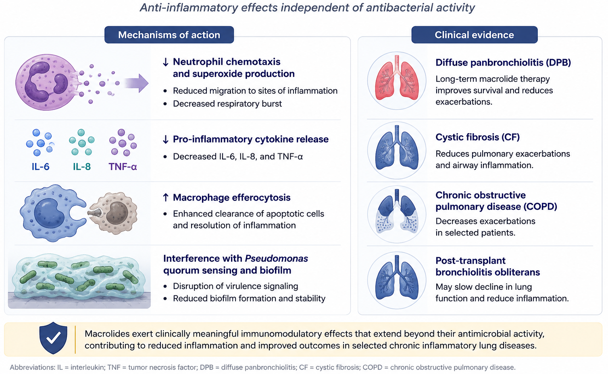
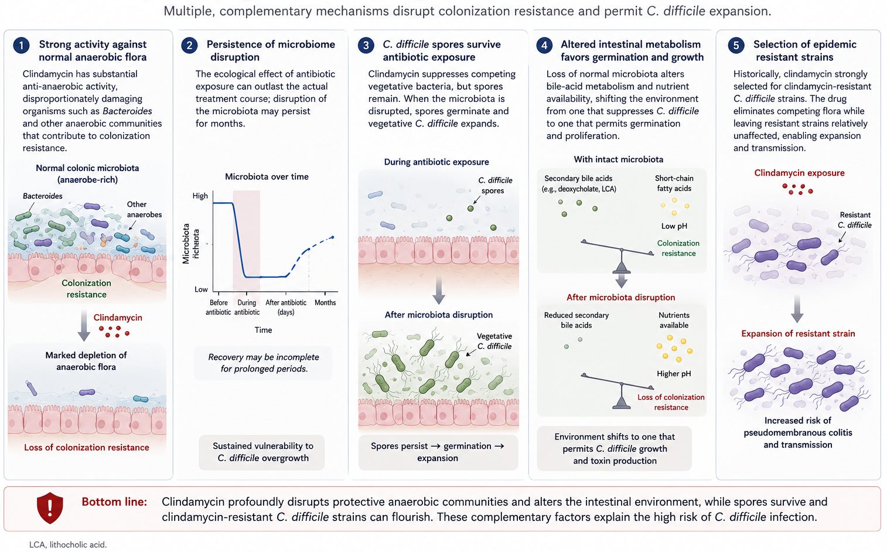

# Introduction

The macrolides have been clinically available for more than seven decades. Erythromycin, isolated from *Saccharopolyspora erythraea* in 1952, defined a new class of orally bioavailable, broadly active antibiotics that became the cornerstone of treatment for atypical pneumonia, pertussis, and many sexually transmitted infections. Modern derivatives — clarithromycin and azithromycin — refined pharmacokinetics and tolerability without expanding the spectrum substantially. The ketolides (telithromycin, solithromycin) were designed to overcome the dominant macrolide-resistance mechanism (MLS~B~) but ran aground on idiosyncratic hepatotoxicity. The lincosamides — represented clinically by clindamycin — are chemically unrelated to macrolides but bind the same ribosomal site and so share resistance mechanisms with them.

This companion document is organized like the lecture: chemistry and mechanism first, then resistance, then pharmacology of each agent, then clinical use organized by indication.

# Chemistry

## Macrolide Structure

{fig-align="center" width="500"}

All macrolides share a **macrocyclic lactone ring** (the macrolactone) to which one or two sugars are appended. The clinically important rings are 14-, 15-, and 16-membered:

- **14-member:** erythromycin, clarithromycin, roxithromycin
- **15-member (azalides):** azithromycin — a nitrogen atom is inserted into the macrolactone, producing the unique pharmacokinetic profile discussed below
- **16-member:** spiramycin, josamycin, tylosin (largely veterinary)

The sugars (desosamine and cladinose for erythromycin; the cladinose is absent in ketolides) contribute to ribosomal binding and to drug interactions with eukaryotic enzymes (notably CYP3A4).

## Ketolides

Ketolides retain the 14-member ring but substitute a **3-keto group** for the L-cladinose at C-3. The keto group makes the molecule a poor substrate for *erm*-mediated methylation and introduces a **second ribosomal contact** at domain II of 23S rRNA (around nucleotide A752), which preserves activity against many MLS~B~-resistant isolates [@Shain2002].

## Lincosamides

Lincomycin and clindamycin do not contain a macrolactone. They consist of an amino acid (4-propylhygric acid for lincomycin) linked to an amino sugar (methylthiolincosamide). Clindamycin is the 7(S)-chloro-7-deoxy analogue of lincomycin, with improved oral absorption and broader Gram-positive activity [@McGehee1968]. Despite the structural difference from macrolides, lincosamides bind the same A2058 region of 23S rRNA, hence MLS~B~ cross-resistance.

# Mechanism of Action

{fig-align="center" width="600"}

Macrolides, ketolides, and lincosamides bind the **50S ribosomal subunit**, specifically the **peptidyl transferase center** of 23S rRNA in domain V. The principal contact residue is **adenine 2058** (*E. coli* numbering); ketolides additionally contact A752 in domain II. Binding blocks the nascent peptide exit tunnel, leading to premature drop-off of peptidyl-tRNA and inhibition of peptide bond formation [@Mao1968].

The drugs are **predominantly bacteriostatic** at clinically achievable concentrations. Bactericidal activity emerges only at high drug-to-bug ratios against highly susceptible organisms (notably *S. pyogenes*). The static/cidal distinction has clinical relevance: macrolides are not appropriate as monotherapy for endocarditis, severe neutropenic infection, or bacterial meningitis.

# Resistance Mechanisms

Three mechanisms account for nearly all clinically relevant macrolide resistance:

## Target Site Modification

The dominant mechanism. ***Erm*** (erythromycin ribosome methylase) gene products mono- or di-methylate the N6 of adenine 2058 of 23S rRNA, preventing drug binding. Because the methylation site is shared, *erm* expression confers full **MLS~B~ cross-resistance** — to **m**acrolides, **l**incosamides, and **s**treptogramin **B** [@Ackermann2003].

*Erm* genes are diverse and mobile:

| Gene | Predominant host | Notes |
|------|------------------|-------|
| **ermA, ermC** | *S. aureus*, coagulase-negative staphylococci | Often inducible |
| **ermB** | Pneumococci, GAS, enterococci, oral streptococci | Predominant in Europe; high MICs |
| **ermF** | *Bacteroides fragilis* | High clindamycin resistance |
| **ermTR** | Group A streptococcus | Common in inducible isolates |
| **Erm(37)** | *M. tuberculosis* (intrinsic) | Why TB is macrolide-resistant despite being a mycobacterium |

: Major *erm* genes [@Ackermann2003] {#tbl-erm}

{fig-align="center" width="600"}

Ribosomal point mutations at **A2058** or **A2059** of 23S rRNA produce similar resistance without methylation. Such mutations are particularly common in organisms with few rRNA operons (1–2 copies), where a single mutational event affects most ribosomes: *M. pneumoniae*, *M. avium*, *N. gonorrhoeae*, *H. pylori*, *Treponema pallidum* [@Kawai2013; @Nash1995; @Ng2002; @Meier1996].

## Constitutive vs. Inducible Expression

*Erm* expression may be **constitutive** (always on; the organism reads as resistant to both erythromycin and clindamycin on susceptibility testing) or **inducible** (transcribed only when a macrolide is present; the organism reads as erythromycin-resistant and clindamycin-susceptible). Inducible MLS~B~ is the clinical trap: clindamycin therapy *itself* can induce *erm* expression mid-treatment and produce emergent resistance with clinical failure [@Siberry2003].

### The D-Test

{fig-align="center" width="400"}

The **D-test** is a disk-diffusion screen for inducible clindamycin resistance. An erythromycin disk is placed adjacent to a clindamycin disk on the AST plate; if *erm* is inducible, the erythromycin diffuses into the area around the clindamycin disk and induces methylation in the bacteria there. The clindamycin zone of inhibition is flattened on the side facing the erythromycin disk, producing a characteristic **"D" shape**. A D-test positive isolate should be reported as **clindamycin-resistant**, regardless of the broth-microdilution MIC [@Siberry2003; @LaPlante2008].

The D-test is routine in clinical microbiology for *Staphylococcus aureus* (especially MRSA, including CA-MRSA) and group A streptococcus.

## Efflux

Active efflux pumps remove macrolides from the bacterial cytoplasm faster than they accumulate. Two systems dominate:

- ***mefA / mefE*** in streptococci — extrudes 14- and 15-member macrolides (erythromycin, clarithromycin, azithromycin) but **not** 16-member macrolides or lincosamides
- ***msrA*** in staphylococci — ABC transporter pumping macrolides and streptogramin B

The **M phenotype** (erythromycin-resistant, clindamycin-susceptible by phenotype, D-test negative) is the hallmark of efflux-mediated resistance. Efflux generally produces lower-level resistance than MLS~B~ — high inocula can overwhelm the pump.

## Enzymatic Inactivation

Esterases and phosphotransferases that destroy macrolides have been described in Enterobacterales but are uncommon clinical drivers of resistance in Gram-positive infection.

# Pharmacology — Macrolides

## Erythromycin

The prototypical macrolide. Multiple oral preparations exist to circumvent the molecule's acid-lability:

```{=html}
<table class="table">
<caption>Erythromycin formulations and pharmacokinetic notes (Table 28.2 from source chapter)</caption>
<thead><tr><th>Preparation</th><th>Route</th><th>Peak (h)</th><th>Concentration (μg/mL)</th></tr></thead>
<tbody>
<tr><td>Base (250 mg)</td><td>Oral</td><td>4</td><td>0.3–1.0</td></tr>
<tr><td>Stearate (250 mg, fasting)</td><td>Oral</td><td>3</td><td>0.2–1.3</td></tr>
<tr><td>Ethylsuccinate (500 mg)</td><td>Oral</td><td>0.5–2.5</td><td>1.5 (0.6 fed)</td></tr>
<tr><td>Lactobionate (500 mg)</td><td>Intravenous</td><td>1</td><td>9.9</td></tr>
</tbody>
</table>
```

**Half-life** is short (1.5–2 hours), mandating q6h dosing. Distribution is broad except for the central nervous system. Erythromycin is **biliary** eliminated; renal failure does not require dose adjustment, but caution is needed in hepatic dysfunction.

Erythromycin is a **substrate and potent inhibitor of CYP3A4**. The interaction list is long and clinically important [@Cooper2002]:

::: {.callout-warning}
## Clinically Important Erythromycin/Clarithromycin Drug Interactions

- Warfarin (↑ INR)
- Simvastatin, lovastatin → rhabdomyolysis (avoid; pravastatin or rosuvastatin safer)
- Cyclosporine, tacrolimus → calcineurin inhibitor toxicity
- Theophylline → toxicity
- Carbamazepine → toxicity
- Digoxin → toxicity (azithromycin shares this via P-glycoprotein, not CYP3A4)
- Colchicine → fatal toxicity reported
- QT-prolonging drugs (amiodarone, sotalol, fluoroquinolones, antipsychotics, methadone) → additive arrhythmia risk
:::

Adverse effects include the dose-related gastrointestinal upset (mediated by motilin-receptor agonism), cholestatic hepatitis (particularly the estolate form), high-tone hearing loss with high IV doses or renal failure, **QTc prolongation**, and an association with infantile **hypertrophic pyloric stenosis** in neonates exposed in the first 2 weeks of life [@Cooper2002; @SanFilippo1976].

## Clarithromycin

Better-tolerated than erythromycin and conveniently dosed twice daily. Its **14-hydroxy metabolite** has independent activity, particularly against *H. influenzae*, which extends the practical spectrum. Half-life of the parent is 3–7 hours; of the metabolite 5–9 hours.

Clarithromycin is a **CYP3A4 inhibitor** comparable to erythromycin and carries the same interaction profile. It has **significant renal elimination** — reduce the dose if creatinine clearance is below 30 mL/min, a detail that is easy to miss.

## Azithromycin

Azithromycin's 15-member azalide structure produces a unique pharmacokinetic profile that explains nearly all of its clinical advantages [@Albert2014]:

- **Half-life** in serum is 40–68 hours; in tissue, 2–4 days.
- **Massive intracellular accumulation** — concentrations in fibroblasts, macrophages, and neutrophils can exceed plasma by 1000-fold.
- **Minimal CYP3A4 inhibition**, so the drug-interaction profile is far more forgiving than erythromycin or clarithromycin.
- **Biliary elimination** with no renal adjustment required.

The tissue–plasma disparity also explains why azithromycin is **unreliable for bacteremic infection** (drug is in cells, not blood) but **ideal for intracellular pathogens** — *Chlamydia*, *Legionella*, *Mycobacterium avium*.

## Comparative Summary

| Property | Erythromycin | Clarithromycin | Azithromycin |
|----------|--------------|----------------|--------------|
| Half-life | 1.5–2 h | 3–7 h (parent), 5–9 h (14-OH) | 40–68 h |
| Active metabolite | No | 14-OH (active) | No |
| CYP3A4 inhibition | Strong | Strong | Minimal |
| Renal adjustment | No | Yes (CrCl < 30) | No |
| Tissue penetration | Moderate | Good | Exceptional (intracellular) |
| Dose frequency | q6h | q12h | q24h or single dose |
| Cardiac risk (QT) | Highest | Intermediate | Lowest (still real) |

: Macrolide quick reference {#tbl-macro-compare}

# Cardiac Safety

{fig-align="center" width="600"}

The mechanism is blockade of the **hERG (IKr) potassium channel** with consequent QTc prolongation and risk of torsades de pointes. Risk is amplified by:

- IV administration or rapid infusion
- Underlying long QT, structural heart disease
- Hypokalemia, hypomagnesemia
- Concurrent QT-prolonging drugs
- Female sex, older age

The pivotal epidemiologic studies — **Ray 2004** for oral erythromycin [@Ray2004], **Ray 2012** for azithromycin [@Ray2012], and the synthesis by **Albert 2014** [@Albert2014] — established a real but small absolute risk, concentrated in patients with structural heart disease or other QT drugs. Ray 2012 estimated approximately **47 excess cardiovascular deaths per million 5-day azithromycin courses** compared with amoxicillin.

::: {.callout-tip}
## Practical QT Risk Stratification
- **Low risk** (young, structurally normal heart, no QT drugs): proceed
- **Moderate risk** (older, mild electrolyte derangement, single QT drug): consider doxycycline if it serves
- **High risk** (long QT, QT > 500 ms, recent torsades, multiple QT drugs): avoid macrolides
- Check baseline ECG and correct K⁺/Mg²⁺ before IV erythromycin in ICU patients
:::

# Antimicrobial Spectrum

Macrolides cover atypical respiratory pathogens (*M. pneumoniae*, *C. pneumoniae*, *Legionella*), *Bordetella*, *Helicobacter*, many streptococci where susceptible, *M. avium* complex, and (variably) *H. influenzae*. They are useful against intracellular pathogens — *T. gondii*, *Bartonella*, *Babesia* (with adjuncts), *Plasmodium* (with adjuncts). They lack reliable activity against Enterobacterales, *P. aeruginosa*, *Acinetobacter*, enterococci, MRSA, or *M. tuberculosis* (the last due to intrinsic *erm(37)* methylation) [@Bermudez2001].

## Pneumococcal Susceptibility — Geographic Variation

The macrolide-resistance landscape varies sharply by region. In broad strokes:

- **North America:** 30–40% resistance in invasive isolates, predominantly *mef*-mediated efflux (lower MICs, M phenotype, clindamycin spared)
- **Europe (especially Mediterranean / Italy):** 20–30% resistance, predominantly *ermB*-mediated MLS~B~ (high MICs, full cross-resistance to clindamycin)
- **East Asia (China, Japan, Korea):** 50–80% resistance, predominantly *ermB*

For invasive pneumococcal disease in Italy, **macrolide monotherapy is inadequate** as empiric coverage; the ATS/IDSA guideline threshold of < 25% resistance is regularly exceeded [@Xu2010].

Macrolide resistance is also rising in ***Mycoplasma genitalium***, now exceeding 50% in many cohorts of men who have sex with men; moxifloxacin is the principal alternative when extended-course azithromycin fails.

# Clinical Uses — Macrolides

## Community-Acquired Pneumonia

The 2019 ATS/IDSA CAP guideline reserves macrolide monotherapy for outpatients with **low resistance prevalence** (< 25%); otherwise it recommends a β-lactam + macrolide combination or a respiratory fluoroquinolone [@Ref294]. Inpatient CAP typically receives ceftriaxone + azithromycin. The macrolide adds atypical coverage and may exert an immunomodulatory benefit even in pneumococcal disease, although the latter remains controversial.

## Atypical Respiratory Pathogens

- ***Mycoplasma pneumoniae*** — azithromycin or doxycycline. Macrolide resistance rising; > 90% in parts of China and Japan, approaching 30% in some European cohorts. Consider doxycycline if no clinical response within 48 hours [@Kawai2013].
- ***Chlamydia pneumoniae*** — azithromycin, clarithromycin, or doxycycline.
- ***Legionella pneumophila*** — azithromycin or levofloxacin; many experts favor levofloxacin for severe disease based on observational data [@Critchley2002].

## Pertussis

Azithromycin (5-day course) or clarithromycin (7-day course) for both treatment and post-exposure prophylaxis of contacts within 21 days of cough onset. In infants under one month, **azithromycin is preferred** because of the historical link between erythromycin estolate and infantile hypertrophic pyloric stenosis [@Aoyama1996; @Sprauer1992; @Ref303].

## *Mycobacterium avium* Complex (MAC)

Macrolide-based three-drug regimens (clarithromycin or azithromycin + ethambutol + rifampin or rifabutin) per the 2020 ATS/ERS/ESCMID/IDSA guideline [@Ref344]. **Never use macrolide monotherapy** for MAC — 23S rRNA mutations emerge rapidly under selection pressure, abolishing the macrolide backbone [@Nash1995].

In the pre–combination antiretroviral era, weekly azithromycin 1200 mg was widely used for primary MAC prophylaxis in AIDS patients with CD4 < 50; the indication is largely obsolete since modern ART.

## Immunomodulation and Chronic Airway Disease

{fig-align="center" width="700"}

The discovery of macrolide immunomodulation came from a single Japanese cohort: low-dose erythromycin transformed diffuse panbronchiolitis from a near-uniformly fatal disease into a manageable chronic illness [@Kudoh1998]. The mechanism is incompletely characterized but includes reduced neutrophil chemotaxis, decreased pro-inflammatory cytokine release, enhanced efferocytosis of apoptotic cells, and interference with *Pseudomonas aeruginosa* quorum sensing [@Mikasa1992; @Keicho2002].

Clinical extensions:

- **Cystic fibrosis** with chronic *P. aeruginosa* colonization — azithromycin three times weekly improves lung function and reduces exacerbations.
- **Non-CF bronchiectasis** — azithromycin reduces exacerbations.
- **COPD** (Albert 2011, NEJM) — daily azithromycin reduced exacerbation rates but was complicated by hearing loss and arrhythmia signals [@Albert2011; @Albert2014].

## *Helicobacter pylori*

Clarithromycin-based triple therapy (PPI + clarithromycin + amoxicillin or metronidazole) was first-line worldwide for two decades. Rising clarithromycin resistance — > 30% in many populations — has substantially eroded efficacy, and the Maastricht VI consensus now favors **bismuth quadruple therapy** as first-line in regions where macrolide resistance exceeds 15% [@Abdellatif2019]. Resistance is driven by 23S rRNA point mutations (A2143G dominant).

## *Chlamydia trachomatis*

Single-dose azithromycin 1 g and doxycycline 100 mg BID × 7 days were considered equivalent for two decades. Recent data have shifted the balance:

- **Geisler 2015 (NEJM)** [@Geisler2015]: doxycycline non-inferior overall but **superior in men with urethritis** (3% failure with doxy vs. 5% with azithro).
- **Lau 2021 (NEJM)** [@Lau2021]: in rectal chlamydia in men who have sex with men, azithromycin **microbiologic cure was 76%** vs. **100% for doxycycline** — a striking difference now reflected in CDC and European guidelines.

Current first-line for non-pregnant adults is **doxycycline × 7 days**; azithromycin is reserved for adherence concerns and for pregnancy.

## Trachoma and Mass Drug Administration

Single-dose azithromycin replaced six-week tetracycline eye ointment after Bailey's 1993 RCT [@Bailey1993]. The WHO **SAFE strategy** for trachoma elimination uses **annual community-wide single-dose azithromycin** as the antibiotic pillar.

The **MORDOR trial** [@Keenan2018; @Keenan2019] extended the concept to childhood mortality reduction. In sub-Saharan Africa, biannual community azithromycin to children aged 1–59 months reduced all-cause mortality by approximately 14%. The benefit persists with continued MDA, but concerns about resistance selection in *S. pneumoniae*, *E. coli*, and *S. aureus* are mounting.

## *Neisseria gonorrhoeae*

Macrolide use in gonorrhea has effectively ended. Widespread resistance (driven by 23S rRNA mutations and *mtr* efflux upregulation [@Ng2002]) led the US CDC in its 2021 update to drop azithromycin from dual therapy. Current recommendation is **ceftriaxone 500 mg IM as single agent**. The European IUSTI guideline still pairs ceftriaxone with azithromycin 2 g but is under active revision [@Ref221]. Solithromycin demonstrated efficacy in a phase 3 trial [@Fernandes2019] but was never approved.

## Toxoplasmosis

**Spiramycin** is used in Europe for primary prevention of vertical transmission when seroconversion is detected during pregnancy; it is not FDA-approved in the United States. Azithromycin and clarithromycin have demonstrable activity against tachyzoites and cyst forms in vitro and in vivo [@Ribeiro2017; @Derouin1990], but the clindamycin-based regimens remain preferred for cerebral toxoplasmosis in sulfa-allergic patients (see below).

## Babesiosis

**Atovaquone + azithromycin** is the preferred regimen for mild-to-moderate babesiosis per the 2020 IDSA guideline [@Krause2000; @Krause2021]. Tolerability is superior to the older clindamycin + quinine combination. Severe disease (high parasitemia, asplenia, hemodynamic compromise) may still receive clindamycin + quinine and exchange transfusion. Immunocompromised patients, especially those on anti-CD20 therapy, require prolonged courses (≥ 6 weeks) with documented clearance.

## Syphilis — Lesson Learned

Single-dose oral azithromycin (2 g) was an attractive penicillin-alternative for syphilis until **treatment failures emerged rapidly** in San Francisco, Ireland, and elsewhere in the 2000s. Resistance is driven by the **A2058G** mutation in 23S rRNA of *T. pallidum*. Azithromycin is **no longer recommended** for syphilis; penicillin desensitization is preferred for allergy.

## Macrolides and COVID-19 — A Cautionary Tale

In early 2020, azithromycin (often paired with hydroxychloroquine) was widely promoted for COVID-19 on the basis of small open-label studies and a mechanistic rationale combining anti-inflammatory and putative antiviral effects. Two large randomized trials subsequently found no benefit: the **RECOVERY trial** (>7,700 hospitalized patients) showed no mortality benefit, and the **PRINCIPLE trial** found no benefit in early outpatient disease. The net effect was a period of azithromycin overprescribing that measurably increased macrolide resistance in some regions — a reminder that enthusiasm without RCT data can drive unintended antimicrobial selection pressure.

# Pharmacology — Ketolides

## Telithromycin

The first ketolide; approved in 2004. Telithromycin's chemistry — the 3-keto group and the keto-aryl side chain that contacts A752 — was designed to overcome MLS~B~ resistance, and biochemically the design worked. Post-marketing experience uncovered a **hepatotoxicity signal** including acute liver failure and death, plus visual disturbances, syncope, and fatal myasthenia gravis exacerbations [@Shain2002]. The FDA restricted the indications in 2007 and added black-box warnings; telithromycin is now rarely used and unavailable in many European markets.

## Solithromycin

Designed as a second-generation ketolide with improved tolerability. Two phase 3 trials in community-acquired bacterial pneumonia (oral and IV-to-oral) demonstrated non-inferiority to moxifloxacin [@Donald2017; @Lang2022]. Activity was confirmed against MLS~B~-resistant pneumococci, macrolide-resistant *M. genitalium*, and *N. gonorrhoeae*.

In **December 2016**, the FDA Antimicrobial Drugs Advisory Committee voted against approval, citing a transaminase elevation signal in approximately 9% of patients and the recent precedent of telithromycin. Subsequent re-submissions did not satisfy the FDA, and solithromycin has never been approved in the US or EU. The phase 3 gonorrhea trial [@Fernandes2019] confirmed efficacy but was moot.

## Newer Ketolides

**Nafithromycin** (Wockhardt) has completed phase 3 trials for CABP in India and is approaching regulatory approval there. Cethromycin reached phase 3 and was abandoned. The class as a whole has stalled.

## Lefamulin — A Different Class, Similar Niche

Lefamulin is a **pleuromutilin** antibiotic, not a ketolide, but it binds the peptidyl transferase center at a distinct site and maintains activity against MLS~B~-resistant pneumococci and atypicals. FDA-approved 2019 for CABP. Both IV and oral formulations are available. QT prolongation and CYP3A4 interactions limit broad use, but lefamulin partially occupies the clinical niche solithromycin would have filled.

# Pharmacology — Clindamycin

## Origins and Chemistry

Lincomycin was isolated in 1962 from *Streptomyces lincolnensis* (Lincoln, Nebraska — hence the genus name). Clindamycin, the 7(S)-chloro-7-deoxy analogue, was developed in 1966 with improved oral absorption and tolerability [@McGehee1968].

## Pharmacokinetics

- **Oral bioavailability ~90%** — among the highest of any antibiotic; IV → PO 1:1 conversion is standard.
- **Half-life** 2.5 hours; q6–8h dosing.
- Excellent **tissue penetration** into bone, joint, lung, abscess, and intracellularly into macrophages and neutrophils.
- **Poor CNS penetration**, even with inflamed meninges.
- **Hepatic metabolism**; no renal dose adjustment required.

## Spectrum

Clindamycin is reliably active against streptococci, methicillin-susceptible *S. aureus*, many community-associated MRSA isolates, and most anaerobes (although *Bacteroides fragilis* resistance is rising). It has antiparasitic activity against *T. gondii*, *P. jirovecii* (with primaquine), *Plasmodium falciparum* (with quinine, via the apicoplast), and *Babesia* (with quinine). It lacks activity against enterococci, *Listeria*, Gram-negative aerobes, and most mycobacteria.

## Resistance

The same MLS~B~ mechanisms that affect macrolides apply to clindamycin, plus the inducible problem highlighted earlier. *B. fragilis* clindamycin resistance has risen to 25–50% in many European centers, abolishing the historical role of clindamycin for empiric intraabdominal infection. *Lnu* nucleotidyltransferase genes are an emerging lincosamide-specific mechanism in streptococci [@Achard2005].

## Adverse Effects — *C. difficile*

{fig-align="center" width="700"}

Clindamycin has the **highest relative risk for *C. difficile* infection** of any commonly prescribed antibiotic in many epidemiologic studies, attributable to its profound impact on colonic anaerobic flora [@Ref444; @Gantz1979; @Meadowcroft1998]. The risk persists for **weeks to months** after exposure and is observed even with topical (vaginal cream) preparations.

The clinical implication is straightforward: do not reach for clindamycin reflexively when a narrower or safer alternative will work, particularly in elderly, hospitalized, or recently antibiotic-exposed patients.

### The SNAP Trial — Questioning the Toxin-Suppression Rationale (ECCMID 2026)

The adjunctive clindamycin domain of the **SNAP trial** (*S. aureus* Network Adaptive Platform) randomized patients with *S. aureus* bacteremia to 5 days of adjunctive clindamycin versus no adjunctive antibiotic. It found **no mortality benefit and a signal of possible harm** — the ICU subgroup showed a 96% posterior probability of higher mortality with clindamycin. Reassuringly, CDI was not increased (1.9% in each arm), although *all-cause* diarrhea was higher with clindamycin; the presumed mechanism of harm is disruption of gut-microbiome colonization resistance rather than CDI specifically. Outcomes stratified by clindamycin susceptibility/MIC were pre-specified but not yet reported at the time of presentation.

This is the largest randomized evaluation of adjunctive clindamycin to date and is a caution against extrapolating the toxin-suppression rationale (established for invasive GAS, see below) to *S. aureus* bacteremia without direct trial evidence.

# Clinical Uses — Clindamycin

## Aspiration Pneumonia and Lung Abscess

Polymicrobial infections with oral aerobes and anaerobes (*Prevotella*, *Fusobacterium*, *Peptostreptococcus*) respond well to clindamycin monotherapy. Alternatives include amoxicillin-clavulanate and ampicillin-sulbactam. Duration is typically 3–6 weeks for established lung abscess based on imaging and clinical response.

## CA-MRSA Skin and Soft Tissue Infection

A reasonable oral option **if the isolate is susceptible AND D-test negative**. Particularly useful in children and pregnant patients, where TMP/SMX and doxycycline are often relatively contraindicated. D-testing is mandatory before commitment to a clindamycin course in staphylococci [@Siberry2003; @LaPlante2008].

## Invasive Group A Streptococcal Infection — Toxin Suppression

The adjunctive role of clindamycin in necrotizing fasciitis and streptococcal toxic shock syndrome is one of the highest-yield concepts in infectious diseases:

::: {.callout-important}
## Why Adjunctive Clindamycin Works in Invasive GAS

1. **Toxin suppression.** As a protein synthesis inhibitor, clindamycin reduces production of M protein, streptolysin O, SpeA, and SpeB — the superantigens and cytotoxins driving streptococcal toxic shock [@Stevens2007].
2. **Eagle effect mitigation.** In fulminant infections, GAS organisms are in stationary phase and do not actively divide. Penicillin, which requires actively growing organisms, loses efficacy ("Eagle effect"). Clindamycin is independent of growth phase.
3. **Anti-inflammatory effects.** Reduced cytokine release contributes to clinical improvement.

For these reasons, add clindamycin to penicillin (or to vancomycin/linezolid + β-lactam in staphylococcal TSS) at the time of diagnosis — do not wait for susceptibilities.
:::

The 2014 IDSA SSTI guideline endorses adjunctive clindamycin for invasive GAS and for staphylococcal TSS.

## Other Toxin-Mediated Infections

The same principle applies to *Clostridium perfringens* myonecrosis (penicillin + clindamycin, with surgical debridement) — clindamycin reduces α- and θ-toxin production [@Stevens1987b].

## Bone and Joint Infections

Clindamycin penetrates bone well. For susceptible MSSA, CA-MRSA, or streptococcal osteomyelitis, clindamycin is a reasonable backbone — particularly when the high oral bioavailability supports long-course outpatient therapy after an IV induction. D-test the staphylococci first.

## *Pneumocystis jirovecii* Pneumonia

**Clindamycin + primaquine** is a salvage regimen for mild-to-moderate PCP in patients failing or intolerant to TMP/SMX. Benfield's 2008 cohort suggested superiority of clindamycin–primaquine over pentamidine for second-line therapy [@Benfield2008; @Safrin1996]. Screen for G6PD deficiency before initiating primaquine.

## Cerebral Toxoplasmosis

In sulfa-allergic patients with AIDS-associated cerebral toxoplasmosis, **pyrimethamine + clindamycin + leucovorin** is the preferred alternative to pyrimethamine + sulfadiazine. Dannemann's 1992 RCT established comparable efficacy with the two regimens [@Dannemann1992; @Pfefferkorn1992]. Maintenance therapy continues until immune reconstitution.

## Bacterial Vaginosis

Topical clindamycin 2% cream or oral clindamycin 300 mg BID × 7 days are alternatives to oral metronidazole for bacterial vaginosis [@Schmitt1992]. Pregnancy use has been associated with reduced spontaneous preterm delivery in selected populations, though this remains controversial [@Haahr2016; @Lamont2017]. Even topical clindamycin cream has been associated with *C. difficile* colitis [@Meadowcroft1998].

## Malaria — The Apicoplast Story

*Plasmodium* species retain a vestigial prokaryotic organelle (the **apicoplast**), and clindamycin inhibits its ribosomes — producing a characteristic delayed-death effect over two parasite replication cycles. Quinine + clindamycin (10 mg/kg PO q8h + 10 mg/kg PO q12h × 7 days) is the WHO regimen for uncomplicated *P. falciparum* malaria in pregnant women and young children when artemisinin-based combination therapy is not appropriate [@Ramharter2005; @Andersen1994].

## Severe Babesiosis

For severe babesiosis or in immunocompromised hosts, **clindamycin + quinine IV** is the historical regimen, though IDSA 2020 also accepts atovaquone + azithromycin as initial therapy given improved tolerability [@Krause2021]. Exchange transfusion is indicated for parasitemia > 10% or end-organ dysfunction.

# Pediatric Considerations

Several of the class-specific caveats above are especially consequential in children:

- **Azithromycin** is preferred in infants and young children — better tolerated, single daily dose.
- **Erythromycin estolate is avoided in infants** — hypertrophic pyloric stenosis risk in the first 6 weeks of life.
- For pediatric skin and soft-tissue infection, clindamycin is a workhorse oral option, though palatability is poor and flavored suspensions help.
- Clarithromycin is dosed pediatrically for MAC, *H. pylori*, and pertussis.
- Macrolide-resistant *M. pneumoniae* is now common in pediatric outbreaks; consider doxycycline or a fluoroquinolone for non-responders over 8 years old.

# Antimicrobial Stewardship Considerations

Macrolides are among the most prescribed antibiotics in ambulatory care worldwide. Heavy use drives macrolide resistance in *S. pneumoniae*, group A streptococci, *H. pylori*, *N. gonorrhoeae*, *M. genitalium*, and *M. pneumoniae*. Reductions in macrolide pressure at the population level have been followed by reductions in pneumococcal macrolide resistance in Finland, Belgium, and US ambulatory settings — demonstrating that the resistance phenotype is reversible if drug pressure is removed.

Practical stewardship priorities:

- Avoid azithromycin monotherapy for viral or self-limited respiratory illness (acute bronchitis, otitis without confirmed bacterial cause).
- De-escalate from broad combinations once pathogen identification is available.
- Audit prolonged maintenance macrolide therapy in CF, non-CF bronchiectasis, and COPD — confirm indication, monitor hearing and QTc.
- Substitute doxycycline for chlamydia in non-pregnant patients.
- Monitor local resistance trends in pneumococcus, GAS, *M. genitalium*, and *N. gonorrhoeae*.

# Key Teaching Points

::: {.callout-tip}
## For the Consult Service
- **A2058 is the keystone** — every clinically important macrolide-resistance mechanism converges on this 23S rRNA residue.
- **MLS~B~ cross-resistance** means *erm*-mediated methylation knocks out clindamycin as well.
- **D-test before clindamycin** for *S. aureus* and group A strep — inducible resistance is a clinical trap.
- **Azithromycin's tissue PK** explains its single-dose chlamydia regimens and the reason serum levels are not useful for bacteremia.
- **Italian pneumococcal resistance** exceeds 25% — macrolide monotherapy is inadequate for empiric CAP coverage locally.
- **Eagle effect** justifies adjunctive clindamycin in invasive GAS and *C. perfringens* — penicillin alone is insufficient against stationary-phase organisms.
- **Doxycycline is now first-line** for urogenital and rectal chlamydia; azithromycin is the alternative.
- **Don't reach for clindamycin reflexively** — CDI risk is real, durable, and may make a "safer" choice (cefazolin, doxycycline, narrow oral β-lactam) preferable.
- **The SNAP trial** found no mortality benefit — and a possible harm signal — from adjunctive clindamycin in *S. aureus* bacteremia; the toxin-suppression rationale established for invasive GAS should not be assumed to extend to other indications without direct evidence.
- **Soft evidence can drive real prescribing surges** — the COVID-19 azithromycin episode (settled negative by RECOVERY and PRINCIPLE) is a cautionary example.
:::

# References {.unnumbered}

